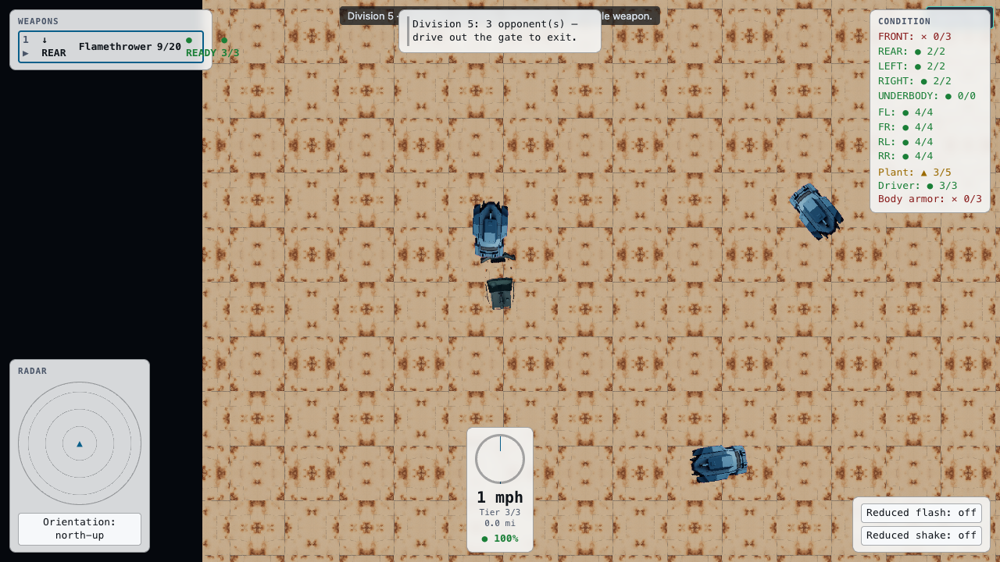

# smduel

**One car. One driver. Sixteen cities and a highway that wants you dead.**

A browser vehicular-combat RPG built for [ShoeMoney Arcade](https://arcade.shoemoney.com/). Build a car from a parts catalog, take courier work between cities, survive the road, and win in the arena. Rendering is WebGPU, the simulation is deterministic at 60Hz, and every gameplay number lives in a JSON ruleset rather than in code.

[Play the game](https://arcade.shoemoney.com/smduel/) · [Rules the JSON cannot hold](docs/SPEC.md) · [Build log](blog/2026-09-26-smduel.md) · [Asset pipeline notes](assets/ASSET-NOTES.md)



## Play

Create a driver and split your starting skill points across driving, marksmanship, and mechanic. Build a car in the constructor by choosing a body, chassis, suspension, power plant, and tires, then bolt on weapons and armor until you run out of money or load capacity. The constructor refuses illegal builds and tells you which constraint you broke.

Screens are numbered keyboard menus. Press a digit to choose an action, or arrow to it and press Enter. In the city you walk with WASD or the arrow keys, press G to enter or leave your car, and walk into a building or the gate. On the road and in the arena you drive with WASD and fire with J.

Money comes from two places. The courier guild pays for cargo delivered to another city before its deadline, and arena events pay for opponents destroyed. Both cost days, and days cost money, so a profitable run is a real constraint rather than a formality. Arena events are gated by cadence and by the value of your car, so you cannot grind the easiest division forever. Losing your car on the road leaves it where it died and walks you back to the city you came from.

Death is not the end. A clone brings you back if you bought one, and the medical building patches you up if you did not. The campaign ends when you deliver the final quest.

## How it is built

| Concern | Approach |
|---|---|
| Gameplay constants | Every number lives in `rulesets/classic/*.json`, AJV-validated, read through `@/data/rulesets`. No gameplay literal appears in TypeScript. |
| Provenance | `rulesets/classic/fidelity-notes.yaml` tags each constant `Exact`, `Observed`, or `Reconstruction`. A coverage test fails the build if a constant has no entry. |
| Simulation | Deterministic seeded RNG on a fixed 60Hz accumulator, so the same seed replays identically. |
| Rendering | WebGPU with an instanced sprite pipeline. `src/render/**` holds a deliberate zero-imports invariant. |
| Persistence | IndexedDB, with a versioned save schema and a migration path. |

The fidelity ledger is the part worth stealing. This is a recreation, so every constant is either something the original published, something observed through play, or something invented to reproduce documented behavior. Recording which of the three it is keeps an honest reconstruction from quietly becoming a guess, and the coverage test means a new constant cannot be added without making that claim explicit.

## Run locally

Node 22 or newer, and a browser with WebGPU enabled.

```sh
npm install
npm run dev
```

The game needs a real WebGPU adapter to render. Chrome on macOS provides one over Metal. Chromium builds without WebGPU will boot to the menus and fail at the render surface.

## Verification

```sh
npm run typecheck   # tsc --noEmit
npm test            # vitest run
npm run build       # typecheck, then a production bundle
```

Tests are plain `vitest run`. Most run in Node; the DOM screen tests declare happy-dom with a `// @vitest-environment happy-dom` pragma on the first line. happy-dom does not compute layout, so those tests assert content and behavior and never geometry.

Performance budgets live in `tests/perf/budgets.test.ts`. It prints measured numbers on every run and gates at roughly ten times the real budget, because an assertion whose signal and threshold share an order of magnitude only teaches you to ignore red.

## Attribution

This is an independent, clean-room reimplementation inspired by the 1985 vehicular-combat RPG genre. It is not affiliated with, endorsed by, or derived from the code or assets of any commercial publisher. All code and generated art here are original to this project.

## License

MIT. See [LICENSE](LICENSE).
