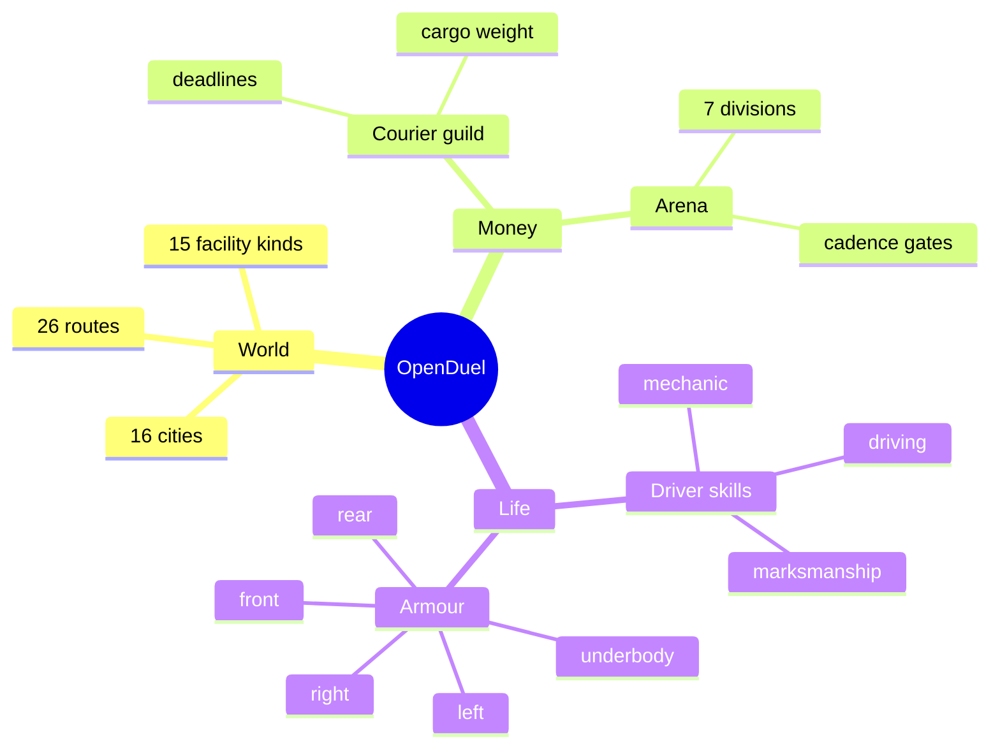
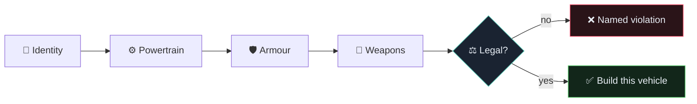
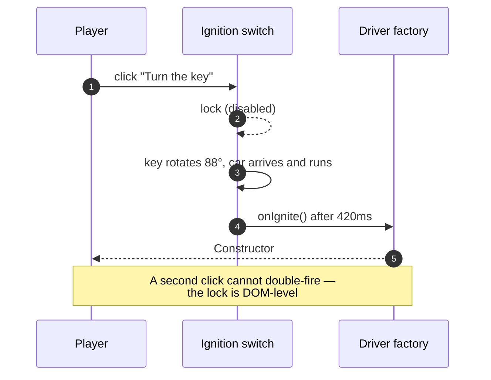
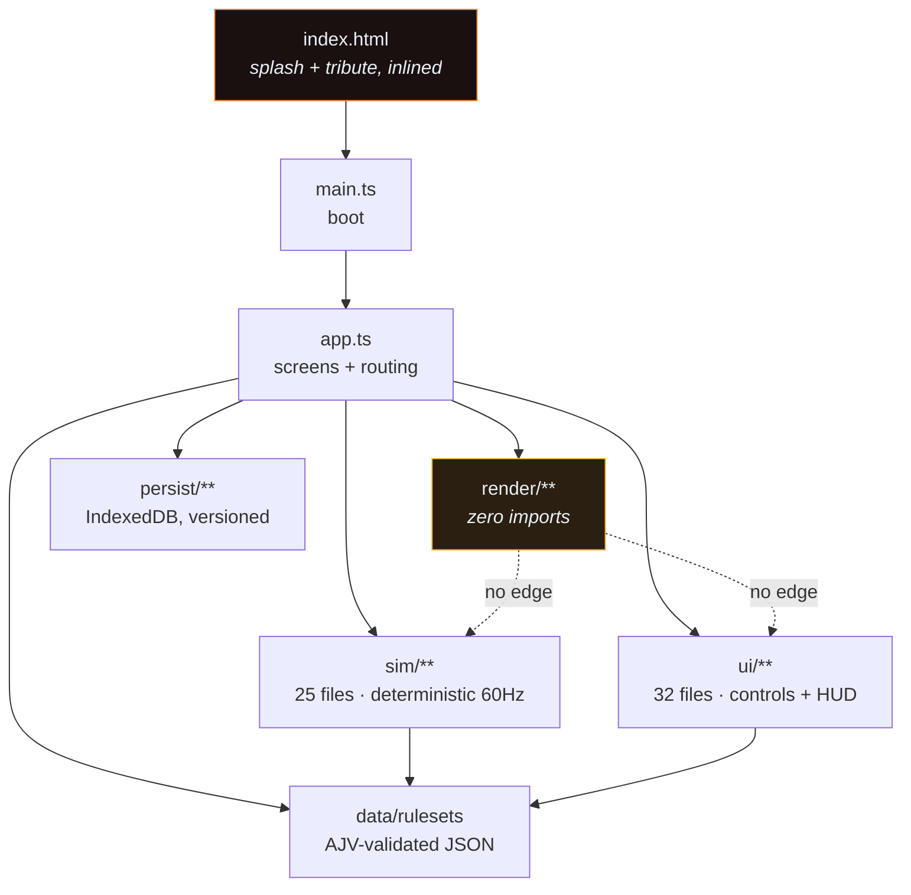
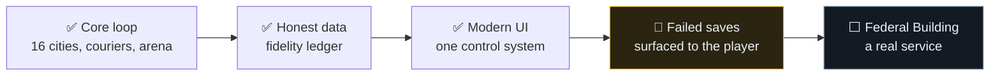

# OpenDuel

```
 ██████╗ ██████╗ ███████╗ ███╗   ██╗███████╗██╗   ██╗███████╗██╗      ██╗
██╔═══██╗██╔══██╗██╔════╝ ████╗ ██║██╔════╝██║   ██║██╔════╝██║      ██║
██║   ██║██████╔╝█████╗   ██╔████╔█║███████╗██║   ██║███████╗██║      ██║
██║   ██║██╔══██╗██╔══╝   ██║╚██╔╝█║██╔════╝██║   ██║╚════██║██║      ██║
╚██████╔╝██║  ██║███████╗ ██║ ╚═╝ ██║███████╗╚██████╔╝███████║███████╗██║
 ╚═════╝ ╚═╝  ╚═╝╚══════╝ ╚═╝     ╚═╝╚══════╝ ╚═════╝ ╚══════╝╚══════╝╚═╝
```

### 🏎️ A Modern Tribute to _Autoduel_ · Apple II, 1985

**One car. One driver. Sixteen cities and a highway that wants you dead.**


[](#play) ](#license)    

> 🕹️ **[Play OpenDuel](https://arcade.shoemoney.com/smduel/)** — no install, no account, just a browser with WebGPU.

---

## 📚 Table of Contents

| 🗺️ Section | 🔍 What's in it |
|---|---|
| [🎮 Play](#play) | What the game actually is, and how to drive it |
| [🧭 The World](#world) | 16 cities, 26 routes, 15 facility kinds |
| [🏗️ Build Your Ride](#build-your-ride) | The constructor and its five sections |
| [💰 Where Money Comes From](#money) | Couriers, arena purses, and the clock |
| [✨ The Interface](#interface) | Ignition switch, icon system, the boot tribute |
| [🧪 Why It Is Built This Way](#why) | The fidelity ledger, and the parts worth stealing |
| [🏗️ Architecture](#architecture) | Boot flow, module map, the render boundary |
| [🚀 Quick Start](#quick-start) | Run it locally in two commands |
| [📖 CLI Reference](#cli) | Every script, and what it actually does |
| [✅ Verification](#verification) | The gates, and what they refuse to let through |
| [🗺️ Roadmap](#roadmap) | What is next, and what is deliberately not done |
| [📜 License & Attribution](#license) | MIT, and the tribute we owe |
| [🤝 Contributing](#contributing) | The rules this repo holds itself to |

---

<a id="play"></a>

## 🎮 Play

OpenDuel is a **vehicular-combat RPG** in the browser. You are a courier with a car
and a debt. Build the car, take the job, survive the highway, take the purse.

| 🕹️ Control | 🔑 Key | 📍 Where |
|---|---|---|
| Choose a menu row | `1`–`9`, `0` | Every menu |
| Move the selection | `↑` `↓` | Every menu |
| Confirm | `Enter` | Every menu |
| Back / pause | `Esc` | Every screen |
| Walk | `WASD` / arrows | City |
| Enter or leave the car | `G` | City |
| Drive | `WASD` / arrows | Road, arena |
| Fire | `Space` or `J` | Road, arena |
| Cycle weapon | `Q` / `E` | Road, arena |
| Journal · Fleet | `J` · `F` | City |

> ⚠️ Every key above is **remappable at runtime** in ⚙️ Controls, and every
> on-screen hint is generated from the live bindings — a hardcoded key in a hint
> is a lie waiting for a rebind.

**Nine screens** make up the game: `Title → Driver Creation → Constructor → City`,
with `Road`, `Arena`, `Fleet`, `Journal`, `Controls` and `Victory` branching off.

---

<a id="world"></a>

## 🧭 The World

<div align="center">



</div>

| 🌍 Fact | 🔢 Value | 📍 Source of truth |
|---|---|---|
| Cities | **16** | `rulesets/classic/cities.json` |
| Routes between them | **26** | `cities.json` → `routes` |
| Facility kinds | **15** | `cities.json` → `facilityKinds` |
| Armour facings | **5** | `src/sim/types.ts` → `FACINGS` |
| Ruleset files | **17** (16 JSON + 1 ledger) | `rulesets/classic/` |
| Starting skills | **3** | `skills.json` |

> 🧠 **A discrepancy we ship rather than hide.** `cities.json` carries a
> `_cityCountNote`: the original's travel graph names **16** cities while its prose
> says **15**. That is unresolved in the source, so it is flagged in the data file
> *and* in the fidelity ledger under `world.cityCount`. We ship 16 and say so.

<details>
<summary>🏙️ The sixteen cities</summary>

New York · Boston · Pittsburgh · Albany · Atlantic City · Baltimore · Buffalo ·
Dover · Harrisburg · Manchester · Philadelphia · Providence · Scranton · Syracuse ·
Washington · Watertown

</details>

---

<a id="build-your-ride"></a>

## 🏗️ Build Your Ride

The constructor is the game's heart, and it is organised into **five sections** so
a wall of rows reads as a specification instead of a form to fill in.

| 📦 Section | 🎛️ What it sets | 🖼️ Glyph |
|---|---|---|
| **Identity** | Your name, the body | 🪪 |
| **Powertrain** | Chassis, suspension, power plant, tires | ⚙️ |
| **Armour** | Five facings, each with its own direction | 🛡️ |
| **Weapons** | Mounts, facing, ammo | 🔫 |
| **Build** | Confirm — or read exactly what is illegal | 🔑 |

Every armour row carries a **shield plus a chevron rotated to the facing it
protects** — up for front, down for rear, across for left and right. Underbody
gets the shield alone, because it has no lateral direction and pointing a chevron
"up" at the underside of a car would assert a direction that does not exist.

<div align="center">



</div>

> 🧾 **A refusal that names the constraint.** "Not road-legal" is not a verdict a
> player can act on. The constructor tells you *which* rule you broke — no name, no
> armour, no mounted weapon, over budget, over capacity — and the live schematic
> draws where the armour actually lands on the chassis.

---

<a id="money"></a>

## 💰 Where Money Comes From

| 💵 Source | 📜 How it pays | ⏱️ What it costs |
|---|---|---|
| **Courier guild** | Per mile, scaled by cargo weight, on delivery to another city | Days, against a deadline |
| **Arena** | Per opponent destroyed, gated by division cadence | Days, and risk of total loss |

Both spend **days**, and days cost money. So the profitable play is a real
constraint, not a formality: the courier run that pays best is the one that most
often strands you past a deadline.

| 💀 When it goes wrong | 🏥 What happens |
|---|---|
| Car destroyed on the road | It stays where it died; you walk back to the city you left |
| Driver dies with no clone | The medical building patches you up |
| Driver dies with a clone bought | The clone brings you back |

The campaign ends when you deliver the final quest. **Death is not the end.**

---

<a id="interface"></a>

## ✨ The Interface

The UI is one system, not a collection of screens that happen to share a
stylesheet. Four hand-built inputs that looked like four different controls became
one factory and one stylesheet, so the driver's name and the arcade score name are
the same box *by construction* rather than by remembering to style them alike.

| 🧩 Piece | 📄 Lives in | 💡 Why it exists |
|---|---|---|
| **Icon set** | `src/ui/icons.ts` | Hand-authored inline SVG on a shared 24×24 grid |
| **Controls** | `src/ui/controls.ts` | One factory for every field, button and panel |
| **Styling** | `src/ui/controls.css` | Focus rings, hover, disabled — token-driven |
| **Display face** | `index.html` | Defined at the only place that can style first paint |

### 🔑 The ignition switch

Creating a driver is an **ignition switch**: the key turns a quarter turn,
overshoots, settles, and *only then* is a driver built.

<div align="center">



</div>

> 🧠 **The delay is the feature, not decoration.** The callback advances a screen,
> so firing on `click` would let a double-click run it twice. The car appears only
> when the starter engages — a silhouette parked in a button nobody has pressed is
> decoration pretending to be feedback.

### 🕯️ The boot tribute

Before the loading bar, on pure black, for 2.6 seconds:

> **INSPIRED BY A CHILDHOOD CLASSIC** — *This game is a modern reimagining of*
> **Autoduel (1985)**. *Original game by* **Origin Systems**, *designed by*
> **Chuckles and Lord British**. *Thank you for the memories.*

White body, **every bold word `#ffd23f`**, enforced by a single CSS rule so the
four lines cannot drift apart about what "bold is yellow" means. It then scrolls
up and out into the loading splash, which keeps its **real** progress bar
throughout — no fake crawl, no timer.

---

<a id="why"></a>

## 🧪 Why It Is Built This Way

This is a **recreation**, so the interesting problem is not writing a car combat
game — it is being honest about which numbers are real.

| 🏷️ Tag | 💭 Means | Example |
|---|---|---|
| `Exact` | The original published it | Route distances, damage tables |
| `Observed` | Measured through play | Encounter rates, AI aggression |
| `Reconstruction` | Invented to reproduce documented behaviour | Pacing constants |

That ledger is the part worth stealing. `rulesets/classic/fidelity-notes.yaml`
tags every constant, and **a coverage test fails the build** if a constant has no
entry — so a new number cannot be added to this game without someone making an
explicit claim about where it came from.

| 🧠 Principle | 🛠️ Enforcement |
|---|---|
| No gameplay literal in TypeScript | Literal-hunting tests over `src/**` |
| Every constant has a provenance | `fidelity-coverage.test.ts` |
| `src/render/**` imports nothing | Zero-import boundary, by design |
| One owner per rule | Duplicated derivations are a build failure |

---

<a id="architecture"></a>

## 🏗️ Architecture

<div align="center">



</div>

| 📦 Area | 📁 Files | 🎯 Responsibility |
|---|---|---|
| Simulation | `src/sim/` · 25 | Seeded RNG on a fixed 60Hz accumulator |
| Interface | `src/ui/` · 32 | Screens, controls, HUD, menus |
| Render | `src/render/` · 9 | WebGPU instanced sprites — **imports nothing** |
| Rulesets | `src/data/` · 3 | AJV validation, typed access |
| Persistence | `src/persist/` · 3 | IndexedDB, versioned, with migrations |
| Arcade | `src/arcade/` · 2 | Score submission |

> 🔒 **The render boundary is load-bearing.** `src/render/**` imports nothing at
> all — not from `sim`, not from `ui`, not from `data`. A renderer that reaches
> into game state is a renderer that cannot be reasoned about, and the zero-import
> rule is what keeps the GPU layer a pure function of bytes.

**Determinism** is the other load-bearing idea: the same seed replays identically,
every time, which is what makes a 16-city world testable at all.

---

<a id="quick-start"></a>

## 🚀 Quick Start

**Node 22+** and a browser with WebGPU. Chrome on macOS provides one over Metal.

```sh
npm install
npm run dev
```

<details>
<summary>🐢 The game needs a real GPU adapter</summary>

Chromium builds without WebGPU will **boot to the menus and fail at the render
surface** — by design, so the failure is legible instead of a black screen. The
splash reports it in plain language rather than hanging.

</details>

---

<a id="cli"></a>

## 📖 CLI Reference

| 🛠️ Command | ⚡ Does | 📝 Notes |
|---|---|---|
| `npm run dev` | Vite dev server | HMR; the splash is inlined, so it paints first |
| `npm run build` | `tsc --noEmit` then a production bundle | Type errors fail the build |
| `npm run preview` | Serves `dist/` | What production actually runs |
| `npm test` | `vitest run` | 75 files in Node / happy-dom |
| `npm run test:watch` | Vitest in watch mode | |
| `npm run test:browser` | Real Chrome, real WebGPU | 7 tests; builds and previews first |
| `npm run typecheck` | `tsc --noEmit` | Strict |

> 🧪 **Two environments on purpose.** `npm test` runs the bulk in Node with
> `happy-dom` for the DOM screens, declared per file with a
> `// @vitest-environment happy-dom` pragma. happy-dom computes no layout, so
> those tests assert content and behaviour and never geometry — anything about
> actual pixels is measured in `npm run test:browser`, in a real browser.

---

<a id="verification"></a>

## ✅ Verification

| 🚦 Gate | 🔢 What it holds |
|---|---|
| `typecheck` | No type errors, strict |
| `npm test` | **1,592+** tests |
| `npm run test:browser` | 7 tests in real Chrome with real WebGPU |
| Fidelity coverage | Every constant has a provenance tag |
| Token guard | No `var()` without a declaration |
| Ruleset validation | AJV schema on every gameplay file |

> 🧠 **A test that passes is not evidence.** Every guard in this repo was
> mutation-proven: the code it guards is changed, the *right* test is confirmed to
> fail, and the change is reverted. A guard that cannot fail teaches you to trust
> a number that means nothing.
>
> The suites are run **repeatedly and in parallel**, because a failure that only
> appears under parallel execution is a timing bug wearing a disguise.

---

<a id="roadmap"></a>

## 🗺️ Roadmap

<div align="center">



</div>

| 🔨 Next | 📌 State | 💭 Notes |
|---|---|---|
| Surface a failed save to the player | 🔨 **next** | A save that cannot be written currently fails silently |
| Federal Building: a real service | ⬜ planned | A complete courier contract through existing machinery |
| Constructor: reclaim the dead space | ⬜ planned | Raised by three separate reviews |

<details>
<summary>🚧 Known open items, stated plainly</summary>

- **One unidentified test failure.** It appeared in 1 of 3 runs, twice, both times
  as the first run after files changed, and never reproduced in 14 subsequent runs.
  No output was captured, so we do not know which test. It is recorded as an open
  intermittent, **not** as a fixed flake.
- **One unverified layout claim.** The road screen's hint sits at a hardcoded
  offset, and the road message feed is `display: none` while empty — so a passing
  overlap check there is an absent element, not a sound layout. The probe prints
  `UNVERIFIED` rather than a clean bill.
- **A dead `roadMessages` path.** The array is written and passed to the HUD, but
  the only producers are traffic-contact events, so the feed is usually empty.

</details>

---

<a id="license"></a>

## 📜 License & Attribution

**OpenDuel is a modern tribute to _Autoduel_ (1985)**, the vehicular-combat RPG
published by **Origin Systems** and designed by **Chuckles and Lord British**,
originally for the **Apple II**.

This is an independent, **clean-room reimplementation**. It contains no code, art,
or data from _Autoduel_ or from any other commercial publisher — every line and
every generated asset here is original to this project. It is not affiliated with,
endorsed by, or sponsored by Origin Systems, and "Autoduel" and its designers are
referenced here solely to credit the work this game pays homage to.

**MIT.** See [LICENSE](LICENSE).

| 📄 Document | 🔍 What it covers |
|---|---|
| [`docs/SPEC.md`](docs/SPEC.md) | The rules the JSON cannot hold |
| [`blog/`](blog/2026-09-26-smduel.md) | The build log |
| [`assets/ASSET-NOTES.md`](assets/ASSET-NOTES.md) | How the sprite atlas is generated |

---

<a id="contributing"></a>

## 🤝 Contributing

The rules this repo holds itself to — all of them learned the expensive way:

| 📜 Rule | 💭 Why |
|---|---|
| Read `AGENTS.md` first | It is the accumulated scar tissue |
| Derive fixtures from production code | Never hand-type a constant the code already holds |
| Mutation-prove every new guard | A test that cannot fail is decoration |
| Assert on the **value**, never on presence | A healthy-looking signal is not a fact |
| Find elements by scanning, never from memory | Stale coordinates produce confident wrong answers |
| Record what you did **not** establish | A partial check is worth more than a clean summary |
| Measure before changing | A measured trade-off is a decision, not a defect |
| Verify the served artefact, not the edited source | Grep source, then the build, then what ships |
| Deploy with a bundle-hash check | A `200` is not proof the right build is live |

```sh
npm run typecheck && npm test && npm run test:browser
```

---

<div align="center">

### 🏁 Built for the road

**Sixteen cities. One car. No second chances you did not pay for.**

<sub>OpenDuel — a modern tribute to <em>Autoduel</em> (1985), Origin Systems,
Chuckles and Lord British. Clean-room, original code and art, MIT licensed.</sub>

</div>
