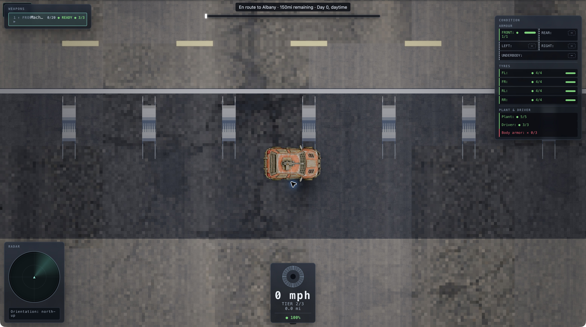

## Live review: findings ranked by player harm

I opened and visually inspected all eight requested screens at seed `a11ce5ee`. The screen captures preserve the display's 2× device pixels. I also tested the normal new-driver/build/city/highway flow, constructor row and body changes, driver allocation, rebinding, movement, and gun firing through ammunition exhaustion.

[Screenshot gallery](index.html) includes the eight screens and interaction evidence, with large previews, shortlisting, comparisons, and PNG downloads. All fixes below are code or UI-copy changes; none requires new art.

### 1. An empty gun still claims it is ready to fire

**Screen/location:** Road, WEAPONS panel, top-left.

- **What is wrong:** I built a Machine Gun with one round, entered the highway, and fired with J. After the ammunition reached `0/20` and the cooldown ended, the row still displayed green **READY**. Further fire input produced no shot.
- **Why it matters:** The combat instrument gives an affirmative signal for an action the car cannot perform. A player can waste an attack opportunity or assume their input failed while looking for the problem elsewhere.
- **What I would do — code:** Derive the displayed state from actual firing eligibility. Show **OUT OF AMMO** when empty, **COOLING** during cooldown, and **READY** only when the weapon can fire. Include insufficient power for weapons that require it. An attempted shot while blocked should briefly explain the reason.

### 2. The constructor's own instructions send the player to a dead action

**Screen/location:** Constructor, LEGALITY panel, lower-right; Weapon rows on the left.

- **What is wrong:** The panel says, “Mount at least one weapon — press Enter on a Weapon row.” Selecting an empty Weapon row and pressing Enter leaves it unchanged. Pressing Right mounts the Machine Gun.
- **Why it matters:** This is a mandatory step in reaching the highway. A new player following the specific instruction can conclude that the builder is broken.
- **What I would do — code/copy:** Change the instruction to “Select a Weapon row; use Left/Right to choose a weapon,” or make Enter open a weapon picker. Generate the prompt from the active bindings. Also separate armour advice from legal requirements: I tested a named, armed, zero-armour build that passed legality, despite the introduction saying armour is required for road legality.

[Constructor evidence](constructor.png).

### 3. Cancelling a rebind can remove the player's driving keys

**Screen/location:** Controls, `driveUp` and `fire` rows in the central panel.

- **What is wrong:** After clicking `driveUp`, pressing Escape assigns **Escape** and replaces its W/ArrowUp bindings. In another test, assigning W to Fire was accepted while W remained assigned to `driveUp`, without a conflict prompt.
- **Why it matters:** A conventional attempt to cancel can unexpectedly disable familiar movement. An accidental duplicate creates ambiguity between driving and firing.
- **What I would do — code:** Make Escape cancel capture and preserve the previous binding. Before accepting a duplicate, name the conflicting action and offer **Swap**, **Keep both**, and **Cancel**. Keep intentional duplicates available. Render readable names such as “Drive up” and “W” instead of `driveUp` and `KeyW`.

[Escape evidence](controls-escape.png) · [Duplicate-binding evidence](controls-conflict.png).

### 4. The weapon row cannot fit the information it needs to show

**Screen/location:** Road, installed-weapon row in WEAPONS, top-left.

- **What is wrong:** With just one Machine Gun mounted, **FRONT** crowds into the name, which truncates to **Mach…**. The selected-slot marker wraps onto a second line. This occurred at a normal desktop viewport, on the car built through normal play.
- **Why it matters:** Identifying the selected gun and its facing becomes a decoding exercise during driving. Additional weapons will make distinguishing rows more important.
- **What I would do — code/layout:** Use a two-line row: slot, full weapon name, and facing on the first line; ammunition, firing state, and condition on the second. Give the selected state a fixed position. Size the panel to fit the longest weapon name at readable text sizes.

[Equipped highway evidence](campaign-road.png).

### 5. Essential setup text is much smaller than the required readable size

**Screen/location:** Constructor, Name field, schematic heading and LEGALITY heading; Driver, inputs and submit button.

- **What is wrong:** Live computed sizes at the desktop viewport were **12.19 CSS px** for the constructor name input, **9.38 px** for the schematic heading, **10.31 px** for LEGALITY, and **14.06 px** for driver inputs/button. These are CSS measurements, not estimates from a downscaled screenshot.
- **Why it matters:** The player has to read purchase choices, validity feedback, and editable values before understanding the game. Increasing display pixel density sharpens small text without making it physically larger.
- **What I would do — code/CSS:** Establish an 18px minimum for labels, metadata, help, and status text; use 20px for normal copy and controls. Keep the root at least 16px and remove smaller rem tokens from readable UI. Let the builder scroll or reorganize its panels instead of shrinking text to fit all rows.

[Constructor](constructor.png) · [Driver](driver.png).

### 6. The Create Driver button's label nearly disappears into its fill

**Screen/location:** Driver, turquoise button at the bottom of the central form.

- **What is wrong:** Its live computed text colour is `#d7e0ea`, against `#4fd6c4`, at 14.06px and weight 600. The contrast is approximately **1.34:1**, well below the 4.5:1 normal-text threshold. The enabled button looks washed out.
- **Why it matters:** The primary action is harder to read and its enabled state is less clear at the first setup step.
- **What I would do — code/CSS:** Use dark ink such as `#101820` on the turquoise fill, with 20px text. Give disabled, enabled, hover, and keyboard-focus states visibly distinct treatments.

[Driver evidence](driver.png).

### 7. The city instructions become a tall column over the map on a narrow screen

**Screen/location:** City, top-centre status/instruction strip, at a 390×844 viewport.

- **What is wrong:** The strip narrows to roughly 130px and grows about 170px tall, wrapping the city/date, movement, car-entry, and destination instructions into a central column over the city.
- **Why it matters:** It obscures the area the player is exploring while making the instructions slower to scan.
- **What I would do — code/layout:** Make a responsive status band use the available width, reserve space for the Arcade control, and put the longer instructions in a dismissible help panel. Preserve the text minimum. This finding concerns layout; this test did not assess coarse-pointer touch controls.

[Narrow city evidence](city-narrow.png).

## Gaps in the game as a whole

**An unfinished service is advertised as a useful destination.** During normal play, I drove into the blue Jobs-marked Federal Building near the starting area. Its menu explicitly says it “isn't open for business yet — coming in a future phase,” with Leave as the only enabled action. This is a content gap in the city activity loop. Implement the service, or identify it as unavailable before the player travels there. Preserve any separate quest use of the building. **Code/content work; no new art needed.** [Evidence](federal.png).

**The exposed setup flow needs guidance about consequences and readiness.** Driver allocation provides driving/marksmanship/mechanic values without explaining what changing a point buys. The constructor shows mechanical totals, but a named car with an unloaded Machine Gun can receive the reassuring “No violations — ready to build.” Legality is useful; it does not tell a beginner whether their gun can shoot or their car is prepared for the highway. Add rules-derived skill explanations, a viable starter-build option, and a separate readiness checklist for ammunition, exposed armour facings, and cash left after purchase. Allow deliberate risky builds after showing their consequences. **Code/copy work.** [Unloaded-build evidence](unloaded.png).

I found no reason in this review to reverse the stated radar, schematic, city-palette, practice-field, initial-zero, or indexed-row decisions. I did not complete a courier delivery, a full highway route, or an enemy-combat balance assessment, so this review makes no claims about those systems' completeness or balance.

The gallery is saved locally. Browser security blocked opening local HTML, and the environment blocked starting a local HTTP server, so its browser interaction checks remain unverified. The game screenshots themselves were inspected.
